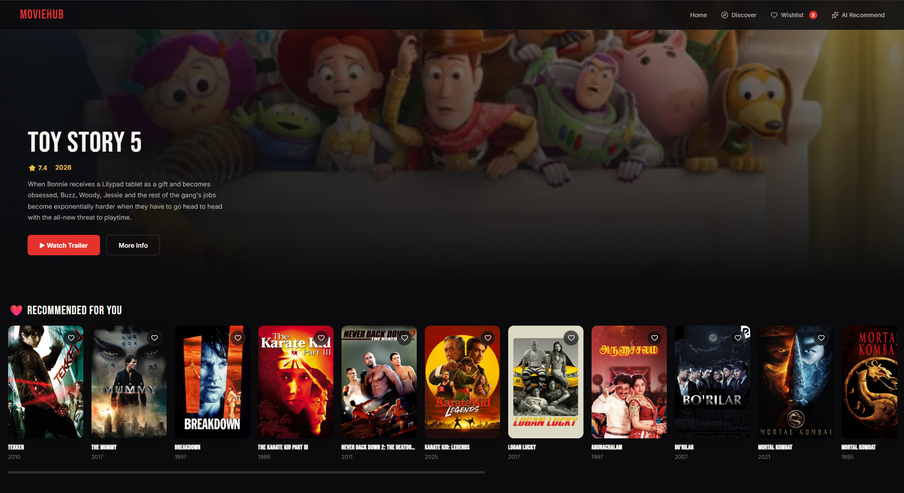
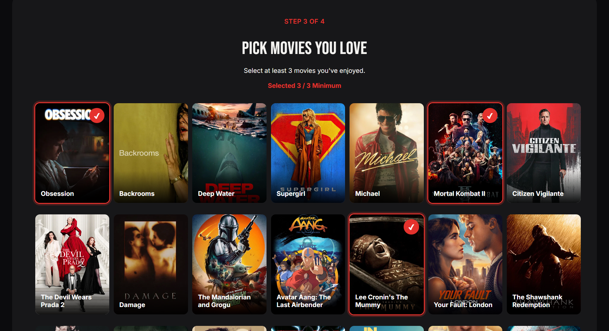
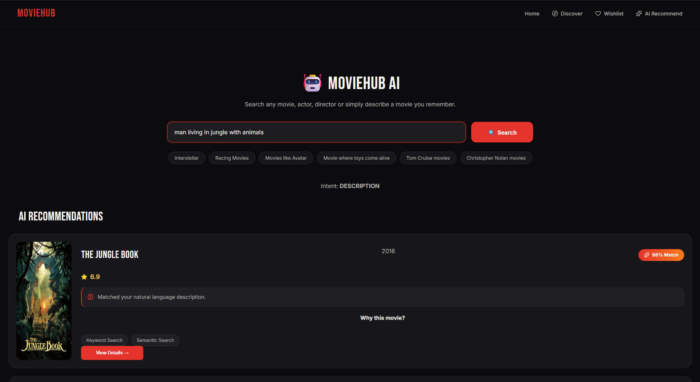
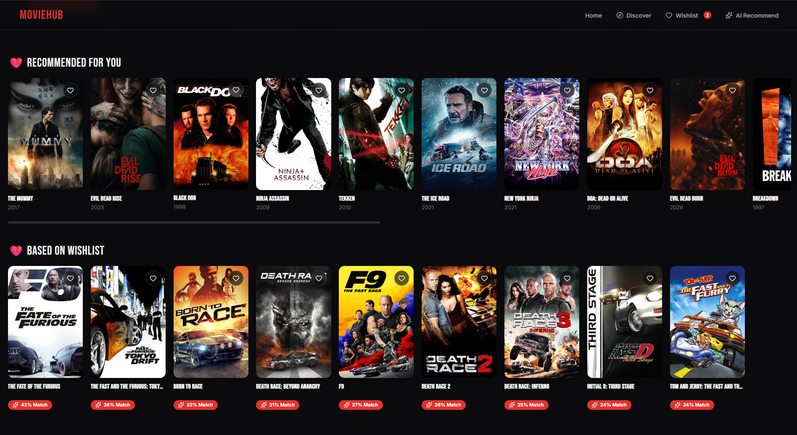
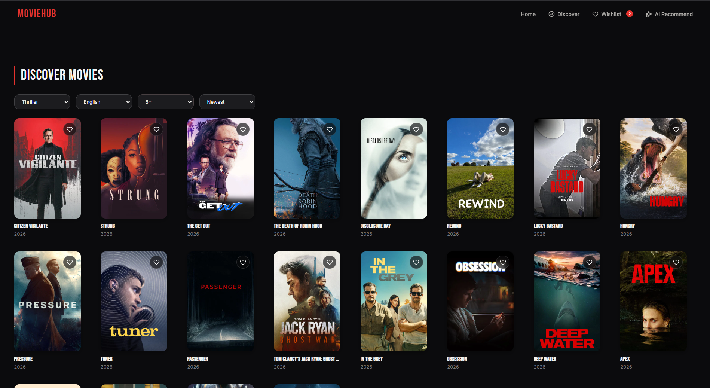

# 🎬 MovieHub AI

 

MovieHub AI is a containerized, hybrid Artificial Intelligence movie recommendation system. Moving beyond standard keyword searches, MovieHub utilizes Natural Language Processing (NLP) and Semantic Search to understand *context*. Whether you search for a specific title, "movies like Inception," or "Tom Cruise action movies," the AI engine analyzes metadata, genres, and overviews to deliver highly accurate, explainable recommendations. 

Powered by a React frontend, a FastAPI backend, and enriched with live TMDB data, the entire application is fully Dockerized for a seamless plug-and-play experience.

---
## 🎯 Why I Chose This Project Specifically

I chose this project to solve the problem of traditional movie recommendation systems that rely mainly on exact keyword searches and popularity. Many users remember only a movie's story, theme, or actor rather than its title. I wanted to build a system that could understand user intent and provide intelligent recommendations using Artificial Intelligence. This project also allowed me to combine multiple technologies such as React, FastAPI, NLP, Machine Learning, APIs, and Docker into one real-world application. It helped me gain practical experience in full-stack development, recommendation systems, semantic search, and modern deployment practices while creating a solution that improves the movie discovery experience.the predictions through a high-performance FastAPI backend. 

## 🌟 What Makes This Project Special

This project stands out because it doesn't just treat machine learning as a theoretical exercise; it addresses real-world production and deployment constraints. 

MovieHub AI is more than a movie browsing website; it is a hybrid AI-powered recommendation platform. It combines semantic search, content-based filtering, and live TMDB data to provide highly personalized recommendations. Users can search using natural language, receive explainable AI recommendations with match percentages, and enjoy features like live autocomplete, advanced filters, trailers, similar movies, and a persistent wishlist. By integrating custom AI with live movie data, MovieHub AI offers a smarter, faster, and more intuitive movie discovery experience than conventional websites.

* **Automated Cloud-Fetching Architecture:** The biggest challenge in deploying ML projects via version control is file size limits (GitHub enforces a 100MB cap), but the pre-computed cosine similarity matrix (`similarity.pkl`) is ~400MB. Instead of compromising the model's complexity to make it fit, I engineered a dynamic boot-time solution. When the Docker container starts, it intelligently checks for the model. If missing, a script automatically downloads it from a hosted cloud environment before the FastAPI server boots.
* **Hybrid AI Approach:** It doesn't rely solely on basic keyword matching. By using `SentenceTransformers` and cosine similarity, it understands the *semantic context* of natural language queries (e.g., "movies where toys come alive"), and then enriches those results with live, real-time data from TMDB APIs. 
* **Explainable AI:** Instead of just outputting a list of movies, the backend calculates exactly *why* a movie is a match (e.g., "Same Genre", "Strong Female Lead") and pushes those tags to the UI, building user trust and transparency.
* **Strict "Plug and Play" DevOps:** The entire application—frontend, backend, and database—is perfectly containerized. A single `docker-compose up` command handles the networking, model fetching, and server initialization seamlessly.
* **Dynamic Recommendation Updates:** Unlike static systems that generate recommendations only once, MovieHub AI continuously refines its suggestions based on user interactions—specifically through the Wishlist. Every time a movie is added, the engine receives new data about the user's evolving interests. 
  > **Example:** If a user initially wishlists *Interstellar* and *Inception*, and later adds *Blade Runner 2049*, the recommendation engine dynamically shifts its centroid vector to prioritize themes like *Science Fiction, Space Exploration, and Artificial Intelligence*, resulting in progressively more accurate future recommendations.
---

## ✨ Key Features
* **🧠 AI Semantic Search:** Describe a movie naturally (e.g., "movie where toys come alive") and the backend's Sentence Transformers will find it using vector embeddings.
* **💡 Explainable AI:** Recommendations come with match percentages and reasoning (e.g., *95% Match: Similar Theme, Space Adventure*), letting users know *why* a movie was suggested.
* **⚡ Live Autocomplete:** Debounced real-time search suggestions featuring movie posters and release years directly in the dropdown.
* **🔍 Advanced Discover Engine:** Filter the local SQLite and TMDB data by genre, language, minimum rating, and custom sorting.
* **☁️ Automated Model Fetching:** Bypasses standard GitHub file limits by intelligently downloading the 400MB `similarity.pkl` ML model from a cloud environment upon container boot.
* **❤️ Persistent Wishlist:** Frontend state management using React Context API for instant additions and live UI counters.
* **🎥 One-Click Trailers & Live Data:** Fetches real-time trending, popular, and top-rated movies, alongside YouTube trailer links, via TMDB APIs.

## 📸 Features in Action

| Onboarding| AI&NLP-based_recommendation |
| :---: | :---: |
|  |  |
| *Fixes Coldstart Issue* | *Recommends movies using NLP* |

| WishList | Advanced Discover Filters |
| :---: | :---: |
|  |  |
| *Recommends movies based on Wishlist* | *Filter by genre, rating, and language.* |


---

## 🏗️ Tech Stack

| Domain | Technologies |
| :--- | :--- |
| **Frontend** | React.js, React Router, Axios, CSS, Lucide React Icons |
| **Backend** | FastAPI, Python, Pandas, NumPy, Scikit-Learn, Sentence Transformers |
| **Database** | SQLite (Local Metadata), TMDB API (Live Data) |
| **DevOps** | Docker, Docker Compose, Cloud-Hosted ML Models |

---

## 🚀 Quick Start (Plug & Play)

This application is completely containerized. You do not need to install Python, Node.js, or any ML libraries on your local machine.

## ⚙️ Set-up & Execution

### Prerequisites
* **Git** installed on your local machine.
* **Docker Desktop** installed and running.
* **Environment Variables:** Obtain the required `.env` file (provided via email) to connect to the necessary services.

### Steps

1. **Open Git Bash or Terminal** and navigate to the folder where you want to store the project:
```bash
   cd path/to/your/folder
   ```
   
2. **Clone the repository:**
```bash
  git clone https://github.com/Jashshah5121/movie-recommendation-system.git
  ```
  
3. **Navigate into the project directory:**
```bash
  cd movie-recommendation-system
```

4. **Add the Environment File:**
Place the `.env` file you received via email directly into the backend directory. The exact file path must be: `backend/.env`

5. **Verify Docker is running:**
Make sure Docker Desktop is open and wait until it shows "Engine running". You can verify it's available from your terminal by running:
```bash
docker --version
docker compose version
```
6. **Boot the Containers:**
Run the following command to build the images, fetch the ML models, and start the network:
```bash
docker-compose up --build
```
6. **Explore the Application:**
Once the terminal indicates both containers are running (and the backend has finished downloading the machine learning model), open your web browser to start exploring!

**Frontend Interface:** http://localhost:5173

**Backend API Documentation:** http://localhost:8000/docs`
  
